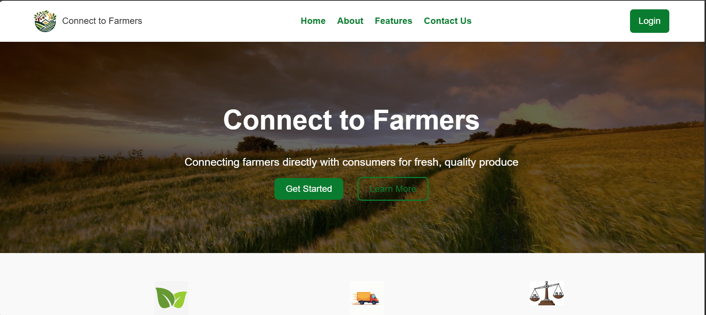
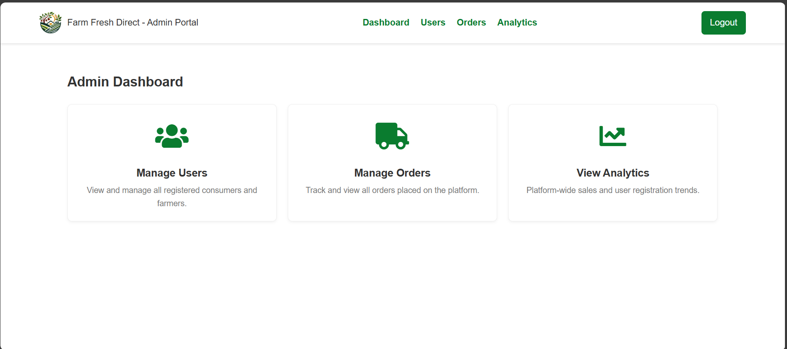

# 🌾 Farm Fresh Direct – Direct-to-Consumer Agritech Platform

**Farm Fresh Direct** is a full-stack web application designed to bridge the gap between rural farmers and urban consumers.  
It offers a digital marketplace where farmers can sell their produce directly to customers, ensuring **fair prices** and **fresher products**.

---

## 🚀 Key Features

### 👩‍🌾 For Consumers
- 🔐 **User Authentication** – Secure login and registration  
- 🛒 **Product Catalog** – Browse, search, and filter fresh produce  
- 🧑‍🌾 **Farmer Profiles** – Build trust and transparency  
- 📦 **Order Management** – Place and view past orders  
- 💬 **Feedback System** – Rate and review products and services  

### 🚜 For Farmers
- 👤 **Profile Management** – Manage personal and verification details  
- 🥦 **Product Management** – Add, update, or remove listings  
- 📬 **Order Processing** – Manage incoming consumer orders  
- 🌐 **Multilingual Support (i18n)** – Multi-language interface  
- 📘 **Information Portal** – Q&A section and soil data resources  

### 🧑‍💼 For Administrators
- 👥 **User Management** – Verify farmers and view all users  
- 📊 **Platform Analytics** – Dashboard for sales and user activity  
- 🧾 **Order Oversight** – Track platform-wide orders  

---

## 🛠️ Tech Stack

| Component | Technology | Description |
|------------|-------------|-------------|
| **Frontend** | HTML5, CSS3, JavaScript | Responsive and interactive UI |
| **Backend** | Node.js, Express.js | RESTful API development |
| **Database** | MongoDB | NoSQL document-oriented storage |
| **Authentication** | JSON Web Tokens (JWT) | Secure token-based access |
| **Internationalization** | i18n (client-side) | Multi-language support via JSON |
| **Estimation Model** | COCOMO | Used for project effort & timeline |

---

## 💻 Local Setup & Installation

### 1️⃣ Clone the Repository
```bash
git clone https://github.com/your-username/farm-fresh-direct.git
cd farm-fresh-direct
```

### 2️⃣ Install Backend Dependencies
```bash
cd server
npm install
```

### 3️⃣ Configure Environment Variables
Create a `.env` file in the `server` directory:
```plaintext
MONGO_URI=your_mongodb_connection_string
JWT_SECRET=your_super_secret_key
```

### 4️⃣ Run the Backend Server
```bash
node server.js
# or
npx nodemon server.js
```

Server will typically run at:  
👉 [http://localhost:3000](http://localhost:3000)

### 5️⃣ Launch the Frontend
Open `public/index.html` in your browser.

---

## 🖼️ Screenshots

| Homepage | Admin Dashboard |
|-----------|----------------|
|  |  |

*(Place your screenshots inside a `screenshots/` folder in your repo.)*

---

## 🌱 Future Enhancements
- ⭐ Rating & Review System  
- 🚚 Live Delivery Tracking  
- 📈 Advanced Farmer Analytics  
- 💳 Secure Payment Gateway (Stripe/Razorpay)  
- 🤖 AI-Powered Crop Recommendations  
- 📱 Native Mobile Apps (Android/iOS)

---

## 📄 License
This project is intended for **educational and demonstration purposes**.  
All code is provided *as-is* without warranty.

---

### 🧰 Maintained By
**Farm Fresh Direct Development Team**  
👩‍💻 Contributions, bug reports, and feature requests are welcome!
